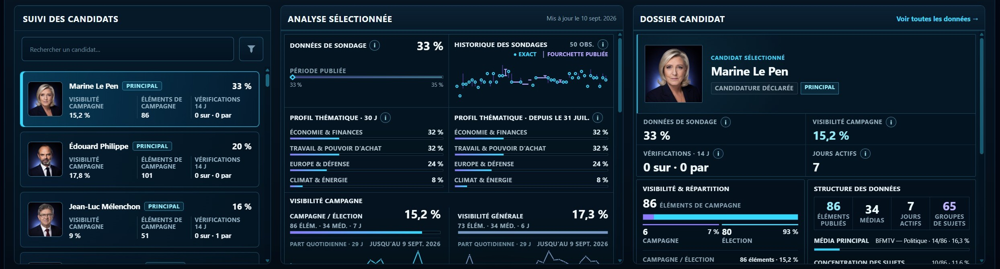
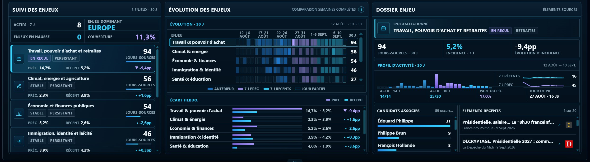
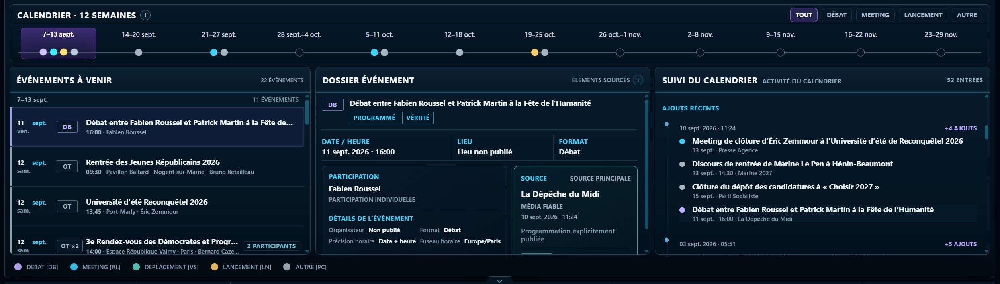

# France 2027 Signal Lab

[English](README.md) · **Français**

**Un terminal de suivi électoral fondé sur des sources vérifiables pour la présidentielle française de 2027.**

**France 2027 Signal Lab (FR27)** est un système indépendant, bilingue et continuellement actualisé de suivi électoral. Il réunit dans une même interface des sondages publiés, l'activité des candidats, la couverture médiatique, l'agenda de campagne, les enjeux de politique publique, les événements de campagne, les vérifications factuelles, les développements juridiques significatifs et les sondages de second tour.

FR27 est construit autour d'une question pratique : **qu'est-ce qui a changé dans la course, et quels éléments permettent de l'établir ?**

Plutôt que de réduire des signaux de nature différente à une moyenne de sondages, un score propriétaire attribué aux candidats, une prévision, une probabilité de victoire ou une recommandation de vote, FR27 préserve la structure, le contexte et la provenance nécessaires pour examiner les éléments eux-mêmes.

**Produit en ligne :** https://france2027.app/<br>
**Interface en anglais :** https://france2027.app/?lang=en<br>
**Dépôt GitHub :** https://github.com/openeventbits/france-2027-signal-lab


*Rapport de force présente séparément les sondages publiés de premier tour, avec leurs sources, leurs dates de terrain, les configurations de candidatures testées et, pour chaque candidat, l'écart brut avec l'observation de premier tour antérieure la plus proche. Un symbole † signale les comparaisons où l'institut de sondage ou le champ de candidatures a changé.*

## Pourquoi FR27 existe

Une campagne présidentielle produit des éléments à des rythmes différents et sous des formes différentes : publications de sondages, annonces de candidatures, déplacements et prises de parole, couverture médiatique, débats sur les politiques publiques, vérifications factuelles, développements juridiques, modifications de calendrier et hypothèses de second tour.

Il est facile de rencontrer ces informations séparément. Il est beaucoup plus difficile de les suivre ensemble sans perdre leur contexte. FR27 transforme cet environnement fragmenté en un système structuré conçu pour une consultation régulière.

Le lecteur peut voir ce qui a changé depuis sa dernière visite ; déterminer si des observations de sondage sont réellement comparables ; suivre la visibilité, l'attention et les éléments de vérification associés aux candidats ; examiner les thèmes de campagne et les enjeux de fond ; identifier les médias qui structurent le corpus mesuré ; consulter les événements à venir et les changements de calendrier ; analyser les scénarios de second tour effectivement testés ; et remonter d'un signal vers les éléments sourcés qui le sous-tendent.

## Ce que suit FR27

| Espace | Ce qu'il permet d'examiner |
| --- | --- |
| **Évolutions** | Un registre sourcé des développements significatifs de la campagne, des sondages, du second tour, des vérifications factuelles et des changements juridiques ou procéduraux importants. |
| **Rapport de force** | Les sondages publiés de premier tour avec leurs dates de terrain, leurs sources, les configurations complètes de candidatures et les écarts bruts par rapport à l'observation antérieure la plus proche de chaque candidat ; les changements de contexte sont signalés et ne sont pas présentés comme des tendances comparables. |
| **Dynamique médiatique** | La visibilité des candidats, les médias, les thèmes, l'activité et les évolutions de couverture dans le corpus électoral retenu par FR27. |
| **Candidats** | Pour chaque candidat : sondages, attention sur Wikipédia, visibilité médiatique, signaux d'agenda, vérifications et dossier sourcé. |
| **Agenda** | Les thèmes liés au processus de campagne et à la stratégie politique, leur persistance, leur évolution et les éléments qui les documentent. |
| **Enjeux** | L'activité autour des thèmes de fond, les associations avec les candidats, les éléments récents et l'évolution des enjeux dans le corpus suivi. |
| **Événements** | Les événements à venir, les dossiers structurés, les sources, la précision horaire, le statut et l'historique des changements de calendrier. |
| **Second tour** | Les sondages publiés de second tour, les confrontations effectivement testées, les écarts observés et l'historique des scénarios comparables. |
| **Outils d'inspection** | Les vues consacrées aux sondages, le Lecteur de couverture électorale, l'Analyse de la couverture, le Signal Desk et le Réseau de sources permettent d'examiner plus finement les éléments publiés et l'état de la collecte. |

Les interfaces française et anglaise reposent sur le même état de publication et non sur deux jeux de données analytiques distincts.

## Les candidats à travers plusieurs signaux

L'espace **Candidats** réunit autour d'un même acteur politique plusieurs flux indépendants sans les transformer en score composite. Selon les données disponibles, une vue candidat peut combiner les sondages de premier tour dans lesquels il est testé, l'attention portée à sa page Wikipédia en français, sa visibilité médiatique, des signaux d'agenda, des vérifications factuelles et un dossier sourcé.



La séparation entre ces mesures est volontaire. L'attention sur Wikipédia n'est pas un soutien électoral. La visibilité médiatique n'est pas une intention de vote. Un sondage n'est pas une prévision. FR27 permet de lire ces signaux ensemble tout en préservant leur signification propre.

## L'environnement médiatique comme corpus mesuré

**Dynamique médiatique** suit l'activité observée dans le corpus de couverture électorale retenu par FR27 : visibilité des candidats, activité thématique, contribution des médias, couverture récente et évolutions entre périodes mesurées.


Il s'agit de mesures de corpus, et non d'affirmations portant sur l'ensemble des médias français ou sur l'opinion publique. Le contexte lié aux médias et au réseau de sources reste visible afin d'interpréter les signaux agrégés à partir de l'univers de collecte qui les a produits.

## Le fond de la campagne

L'espace **Enjeux** suit les thèmes de politique publique présents dans la couverture électorale acceptée. Il distingue leur présence, leur évolution, les associations entre candidats et thèmes, ainsi que les éléments sourcés derrière ces signaux agrégés.



Une hausse de l'activité observée signifie qu'un thème est devenu plus présent dans le corpus mesuré. Elle ne signifie pas que les électeurs y accordent davantage d'importance. De même, une association entre un candidat et un thème n'implique ni adhésion, ni appropriation de l'enjeu, ni position idéologique.

FR27 suit séparément les thèmes de l'**Agenda de campagne** : candidatures, soutiens, primaires, stratégie partisane, règles et calendrier de campagne, positionnement politique, questions d'éligibilité ou récits sur l'état de la course.

## Suivi prospectif : les événements de campagne

L'espace **Événements** organise dans un calendrier commun des informations de programmation appuyées par des sources. Il couvre notamment réunions publiques, meetings, déplacements, débats, lancements de campagne, interventions médiatiques programmées, conférences de presse, conventions et échéances institutionnelles pertinentes.



Les dossiers peuvent conserver les participants, le type d'événement, la date, le niveau de précision horaire, le lieu, l'organisateur, la provenance de la source, l'état de vérification et l'historique du statut. **Suivi du calendrier** enregistre les ajouts, confirmations, reports, annulations et autres mises à jour validées.

Une information ambiguë n'est pas silencieusement promue au rang d'événement confirmé, et une précision horaire absente n'est pas inventée.

## Principes méthodologiques

La méthodologie de FR27 repose sur quelques contraintes fortes.

**Les événements de sondage sont atomiques.** Un sondage de premier tour conserve son institut, ses dates de terrain, son tour, son hypothèse, la configuration complète des candidatures, les valeurs publiées et la provenance de la source.

**Les configurations comptent.** Deux observations ne sont traitées comme comparables que lorsque la structure des scénarios le permet. Des configurations de candidatures incompatibles ne sont pas silencieusement fusionnées dans une même tendance.

**Une information manquante reste manquante.** Une donnée indisponible, partielle, ambiguë ou non résolue n'est pas transformée en faux zéro, en estimation ou en résultat artificiellement complet.

**Les mesures fondées sur un corpus sont présentées comme telles.** La visibilité médiatique et les mesures d'agenda décrivent l'activité observée dans le corpus accepté par FR27. L'indicateur d'attention sur Wikipédia mesure les consultations d'articles en français ; il ne mesure ni sentiment, ni approbation, ni soutien électoral, ni intention de vote.

**Les éléments de second tour restent empiriques.** FR27 distingue les confrontations effectivement testées de celles qui ne l'ont pas été et ne fabrique pas de résultats pour des combinaisons hypothétiques.

**Aucun score synthétique de la course.** FR27 ne publie ni moyenne maison des sondages, ni prévision, ni probabilité de victoire, ni indice composite de dynamique, ni score idéologique, ni score de sentiment, ni conseil de vote. L'absence de couche prédictive est un choix de conception : le produit vise à rendre les éléments sous-jacents plus faciles à inspecter, pas à les remplacer par une réponse propriétaire.

Lorsqu'un élément ne peut pas être extrait, rapproché, classé, daté ou attribué avec un niveau de confiance suffisant, FR27 préfère un état explicitement non résolu ou indisponible à une fausse certitude.

Les définitions détaillées et les limites figurent dans [`docs/METHODOLOGY.md`](docs/METHODOLOGY.md).

## De la source au signal

FR27 est conçu pour qu'un signal dérivé n'efface pas la chaîne d'éléments qui l'a produit.

```text
Sources publiques et sources de première main
        ↓
Collecte et lecture propres à chaque type de source
        ↓
Normalisation, classification et identités déterministes
        ↓
Contrats de données exécutables et validation
        ↓
Fichiers de publication versionnés
        ↓
Historiques et signaux dérivés sur les candidats et la course
        ↓
Manifeste de publication et contrôles d'intégration
        ↓
Interface publique
```

Un sondage publié reste un élément provenant d'un institut tiers. Une part de visibilité médiatique reste une mesure dérivée d'un corpus accepté. Une conclusion de vérification factuelle reste celle du média qui l'a publiée. Un événement conserve sa source et son statut de vérification. FR27 ajoute de la structure, de la comparabilité, de la provenance et une organisation dérivée sans modifier la signification des éléments sous-jacents.

Voir [`docs/DATA_AND_PROVENANCE.md`](docs/DATA_AND_PROVENANCE.md) pour les flux de publication, les classes de sources, la fraîcheur, la provenance et les limites d'interprétation.

## Publication automatisée, sortie inspectable

L'interface publique est volontairement statique et inspectable, mais le système qui l'alimente n'est pas une page maintenue manuellement.

Des collecteurs et générateurs Python récupèrent, normalisent, classent, valident et construisent les données publiées. Des workflows GitHub Actions dédiés actualisent plusieurs flux majeurs, notamment l'actualité électorale, les sondages, l'attention portée aux candidats, le statut des candidatures et les vérifications factuelles. D'autres jeux de données contrôlés sont reconstruits et validés à partir de leurs entrées de référence lorsque leurs éléments évoluent.

Les mises à jour de production sont conçues pour échouer de manière sûre : une sortie candidate est validée avant sa promotion, les fichiers dérivés sont reconstruits dans un ordre contrôlé, l'état de publication est vérifié au moyen de `publication_manifest.json`, l'état de santé des sources est suivi séparément des éléments politiques et la dernière version valide peut être conservée lorsqu'un remplacement ne satisfait pas à son contrat.

L'architecture de collecte médiatique repose sur un vaste réseau configuré de routes de médias, de flux directs, de chemins de découverte et d'autres sources publiques. Les décomptes courants, la fraîcheur des flux, l'état de validation, les avertissements et les métadonnées de publication sont exposés dans le manifeste de publication et dans le **Réseau de sources**, plutôt que figés ici sous forme de chiffres promotionnels.

Pour les détails techniques, voir [`docs/ARCHITECTURE.md`](docs/ARCHITECTURE.md) et [`docs/OPERATIONS.md`](docs/OPERATIONS.md).

## Documentation

- [`docs/PRODUCT_GUIDE.md`](docs/PRODUCT_GUIDE.md) — carte du produit et guide de lecture des différents espaces.
- [`docs/METHODOLOGY.md`](docs/METHODOLOGY.md) — périmètre de recherche, définition des mesures, classifications, comparabilité et limites.
- [`docs/DATA_AND_PROVENANCE.md`](docs/DATA_AND_PROVENANCE.md) — flux de publication, provenance des sources, fraîcheur et limites des éléments.
- [`docs/ARCHITECTURE.md`](docs/ARCHITECTURE.md) — collecteurs, générateurs, contrats, fichiers publiés, intégration de l'interface et architecture de publication.
- [`docs/OPERATIONS.md`](docs/OPERATIONS.md) — mises à jour de production, validation, gestion des échecs, intégrité de la publication et reproductibilité.
- [`CONTRACT.md`](CONTRACT.md) — invariants des données et du dépôt qui ne doivent pas être enfreints.

## Indépendance

France 2027 Signal Lab est développé de manière indépendante. Il n'est affilié à aucun candidat, parti politique, institut de sondage, média, organisme public ou autre organisation représentée dans ses données ; il n'est ni soutenu ni exploité pour le compte de l'une de ces entités.

FR27 suit une élection encore mouvante. Le statut des candidats, la couverture des sources, les jeux de données, les classifications, les interfaces et les méthodes de production peuvent évoluer à mesure que de nouveaux éléments deviennent disponibles.

## Licences et réutilisation

Le dépôt est accessible au public et son code source peut être consulté, mais le logiciel n'est pas distribué sous une licence reconnue comme open source par l'OSI.

Le logiciel original de FR27 est placé sous **PolyForm Noncommercial License 1.0.0**. Les contenus originaux non logiciels protégés sont placés sous **Creative Commons Attribution-NonCommercial 4.0 International (CC BY-NC 4.0)** sauf indication contraire. Les contenus provenant de tiers restent soumis aux droits, licences, conditions des sources et règles juridiques qui leur sont applicables.

FR27 ne revendique aucun droit exclusif sur des faits pouvant être obtenus indépendamment au seul motif qu'ils apparaissent dans le projet.

Voir [`LICENSE`](LICENSE), [`NOTICE`](NOTICE), [`CONTENT_LICENSE.md`](CONTENT_LICENSE.md) et [`THIRD_PARTY_NOTICES.md`](THIRD_PARTY_NOTICES.md) pour le cadre juridique de référence.

## Contributions et contact

Les signalements de bugs, les corrections factuelles ou de sources, les problèmes de reproductibilité et les corrections de documentation sont les bienvenus. FR27 n'accepte pas actuellement de contributions externes substantielles et non sollicitées portant sur du code ou d'autres contenus susceptibles d'être protégés par le droit d'auteur. Voir [`CONTRIBUTING.md`](CONTRIBUTING.md).

Pour toute demande concernant les autorisations ou une licence commerciale : **contact@france2027.app**
