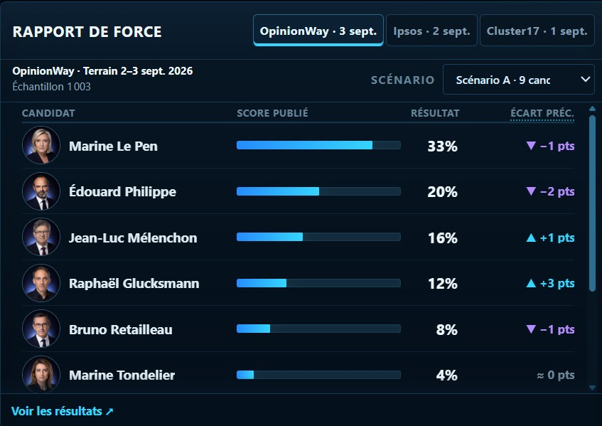
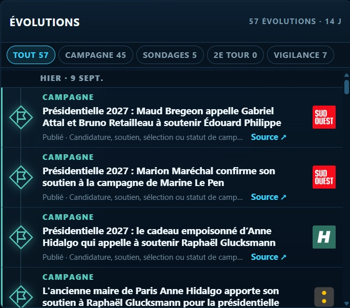
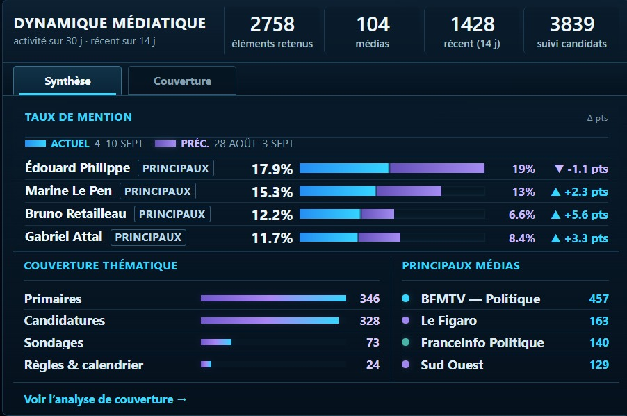

# France 2027 Signal Lab

[English](README.md) · **Français**

**Des signaux sourcés sur la course présidentielle française.**

**France 2027 Signal Lab (FR27)** est un tableau de bord public et indépendant consacré au suivi de l’élection présidentielle française de 2027 à partir de sondages publiés, de l’activité de campagne, de la couverture médiatique, de signaux liés à l’agenda et aux enjeux de politique publique, de vérifications factuelles, d’événements de campagne et de sondages de second tour.

Il organise différents types d’éléments sans les transformer en moyenne de sondages, prévision électorale, probabilité de victoire ou score propriétaire attribué aux candidats.

**Tableau de bord en ligne**

Français · https://france2027.app/ 
English · https://france2027.app/?lang=en

**Dépôt GitHub :** https://github.com/openeventbits/france-2027-signal-lab

*Rapport de force. Les sondages de premier tour sont présentés individuellement, avec leurs sources, leurs dates de terrain et leurs configurations de candidatures.*

## Ce que suit FR27

- **Ce qui a changé** — les évolutions récentes concernant la campagne, les sondages, le second tour, les vérifications factuelles et les développements juridiques ou judiciaires significatifs.
- **La course en un coup d’œil** — les sondages de premier tour présentés individuellement avec leurs dates de terrain, les configurations de candidatures, les sources et le contexte nécessaire à leur comparaison.
- **Couverture médiatique** — le suivi sourcé de la couverture électorale, notamment la visibilité des candidats, les thèmes, les éditeurs et l’activité récente.
- **Candidats** — les sondages, l’activité de campagne, les thèmes associés, la structure de la couverture médiatique, les éléments faisant l’objet d’un examen critique et les dossiers sourcés pour chaque candidat.
- **Agenda et enjeux** — l’évolution des priorités de campagne, les enjeux de fond, les associations avec les candidats et les éléments sourcés.
- **Événements de campagne** — les activités programmées, les dossiers documentés liés aux événements, les événements à venir et les changements de programme.
- **Second tour** — les sondages publiés portant sur le second tour, les confrontations les plus fréquentes, les écarts observés et l’historique des scénarios comparables.

La couverture peut également être consultée dans le **Lecteur de couverture électorale** et dans **Analyse de la couverture**. **Réseau de sources** donne une vue sur l’univers de collecte configuré par FR27.

## Comment lire FR27

**Des éléments sourcés.** Les signaux significatifs doivent pouvoir être reliés à leur source ou à leur provenance.

**Aucune couche prédictive.** FR27 ne publie ni moyenne de sondages, ni prévision électorale, ni probabilité de victoire, ni recommandation de vote, ni score propriétaire attribué aux candidats.

**Uniquement des éléments comparables.** Les scénarios de sondage reposant sur des configurations de candidatures différentes ne sont pas silencieusement fusionnés dans une même tendance. Les sondages de premier tour sont conservés comme des événements complets plutôt que comme des séries de scores isolés par candidat.

**Aucune valeur manquante inventée.** Une information absente, indisponible, partielle ou non résolue n’est pas transformée en faux zéro ou en estimation.

**Des mesures limitées au corpus.** Les mesures concernant les médias et l’agenda décrivent les éléments observés dans le corpus de sources accepté par FR27. L’indicateur d’attention sur Wikipédia mesure les consultations des articles de Wikipédia en français ; il ne mesure ni le nombre de personnes uniques, ni le sentiment, ni l’approbation, ni le soutien électoral, ni l’intention de vote.

Lorsqu’un élément ne peut pas être extrait, rapproché, classé, daté ou attribué avec un niveau de confiance suffisant, FR27 privilégie son omission ou l’affichage explicite d’un état non résolu plutôt qu’un résultat trompeur.

Les définitions détaillées des mesures et leurs limites sont présentées dans [`docs/METHODOLOGY.md`](docs/METHODOLOGY.md).

## Panneaux de synthèse

| Évolutions | Dynamique médiatique |
| --- | --- |
|  |  |
| Évolutions récentes concernant la campagne, les sondages, le second tour, les vérifications factuelles et les développements juridiques significatifs. | Couverture électorale sourcée, notamment la visibilité des candidats, les thèmes, les éditeurs et l’activité récente. |

## Un produit conçu pour être inspectable

FR27 est avant tout un produit public statique fondé sur des données et du code versionnés et consultables. Des pipelines Python collectent, normalisent, classent et génèrent les fichiers de publication ; des validations automatisées et des tests de régression protègent les contrats de données ; les workflows de production s’exécutent avec GitHub Actions ; et l’interface JavaScript/CSS est publiée avec GitHub Pages.

Les processus automatisés de mise à jour sont conçus pour ne pas publier de sortie invalide : une nouvelle sortie est validée avant sa publication, et la dernière version valide reste disponible lorsqu’un remplacement ne satisfait pas aux règles prévues.

## Documentation

- [`docs/PRODUCT_GUIDE.md`](docs/PRODUCT_GUIDE.md) — comment lire le tableau de bord et ses différents espaces.
- [`docs/METHODOLOGY.md`](docs/METHODOLOGY.md) — périmètre de recherche, définition des mesures, classifications, comparabilité et limites.
- [`docs/DATA_AND_PROVENANCE.md`](docs/DATA_AND_PROVENANCE.md) — jeux de données, sources, provenance, actualisation et limites du corpus.
- [`docs/ARCHITECTURE.md`](docs/ARCHITECTURE.md) — pipelines, contrats, fichiers générés, interface, workflows et architecture de publication.
- [`docs/OPERATIONS.md`](docs/OPERATIONS.md) — validations, mises à jour de production, gestion des échecs, intégrité de la publication et reproductibilité.
- [`CONTRACT.md`](CONTRACT.md) — invariants du dépôt et des données qui ne doivent pas être enfreints.

## Licences et réutilisation

Le dépôt est accessible au public et son code source peut être consulté, mais le logiciel n’est pas distribué sous une licence reconnue comme open source par l’OSI.

- Le logiciel original de FR27 est placé sous **PolyForm Noncommercial License 1.0.0**.
- Les autres contenus originaux protégés sont placés sous **Creative Commons Attribution-NonCommercial 4.0 International (CC BY-NC 4.0)** sauf indication contraire.
- Les contenus provenant de tiers restent soumis aux droits, licences, conditions des sources ou règles juridiques qui leur sont applicables.

Toute utilisation commerciale des contenus originaux protégés de FR27 nécessite une autorisation distincte. FR27 ne revendique aucun droit exclusif sur des faits pouvant être obtenus indépendamment au seul motif qu’ils apparaissent dans le projet.

Les conditions complètes figurent dans [`LICENSE`](LICENSE), [`NOTICE`](NOTICE), [`CONTENT_LICENSE.md`](CONTENT_LICENSE.md) et [`THIRD_PARTY_NOTICES.md`](THIRD_PARTY_NOTICES.md).

## Contributions

Les signalements de bugs, les corrections factuelles, les corrections de sources, les problèmes de reproductibilité et les corrections de documentation sont les bienvenus. FR27 n’accepte pas actuellement de contributions externes substantielles et non sollicitées portant sur du code ou d’autres contenus susceptibles d’être protégés par le droit d’auteur. Les modalités sont précisées dans [`CONTRIBUTING.md`](CONTRIBUTING.md).

## Indépendance et statut

France 2027 Signal Lab est un projet public de recherche développé de manière indépendante. Il n’est affilié à aucun candidat, parti politique, institut de sondage, éditeur, organisme public ou autre organisation représentée dans ses données. Il n’est ni soutenu ni exploité pour le compte de l’une de ces entités.

FR27 suit activement une course présidentielle encore mouvante. Les jeux de données, le statut des candidats, la couverture des sources, les classifications, les interfaces et les méthodes de production peuvent évoluer à mesure que de nouveaux éléments deviennent disponibles.

Pour toute demande concernant les autorisations ou une licence commerciale :

**contact@france2027.app**
