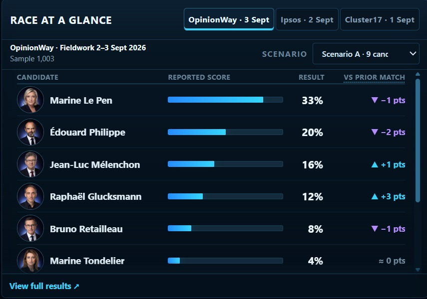
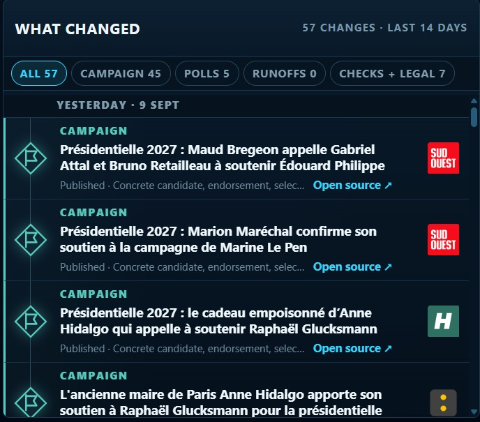
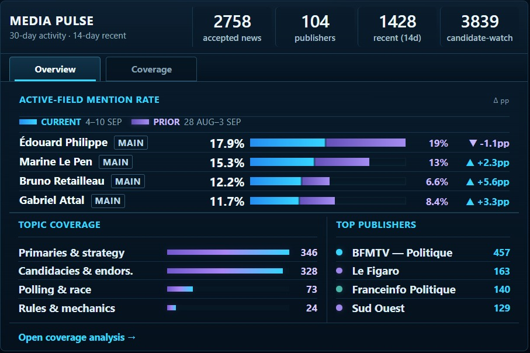

# France 2027 Signal Lab

**English** · [Français](README.fr.md)

**Source-linked signals from the French presidential race.**

**France 2027 Signal Lab (FR27)** is an independent public dashboard tracking the 2027 French presidential election through published polling, campaign activity, media coverage, policy and agenda signals, fact-checking, campaign events, and second-round polling.

It organizes different kinds of evidence without turning them into a polling average, forecast, win probability, or proprietary candidate score.

**Live dashboard**

French · https://france2027.app/ 
English · https://france2027.app/?lang=en

**Repository:** https://github.com/openeventbits/france-2027-signal-lab

*Race at a Glance. First-round poll events are shown individually, with their sources, fieldwork and candidate configurations.*

## What FR27 tracks

- **What Changed** — recent campaign, polling, runoff, fact-check, and material legal developments.
- **Race at a Glance** — individual first-round poll events with fieldwork dates, candidate configurations, sources, and comparison context.
- **Media Pulse** — source-linked election coverage, including candidate visibility, topics, publishers, and recent activity.
- **Candidates** — candidate-level polling, campaign attention, agenda evidence, coverage structure, scrutiny, and source-linked dossiers.
- **Agenda and Issues** — evolving campaign priorities, substantive issues, candidate associations, and source-linked evidence.
- **Campaign Events** — scheduled activity, evidence-backed event dossiers, upcoming events, and schedule changes.
- **Runoff** — published second-round polling, common matchups, observed margins, and comparable matchup history.

Coverage can also be inspected through the **Election Coverage Reader** and **Coverage Analysis**. **Source Network** exposes information about the configured collection universe.

## How to read FR27

**Source-linked.** Material signals should remain traceable to their underlying source or provenance.

**No prediction layer.** FR27 does not publish polling averages, election forecasts, win probabilities, voting recommendations, or proprietary candidate scores.

**Comparable evidence only.** Poll scenarios with different candidate configurations are not silently combined into a common trend. First-round polling is stored as complete poll events rather than disconnected candidate scores.

**No invented missing values.** Missing, unavailable, partial, or unresolved evidence is not converted into a false zero or estimate.

**Corpus-aware.** Media and agenda measures describe evidence observed within the accepted FR27 source corpus. Wikipedia Attention measures views of French-language Wikipedia articles; it is not a measure of unique individuals, sentiment, approval, electoral support, or voting intention.

When evidence cannot be parsed, reconciled, classified, dated, or attributed with sufficient confidence, FR27 prefers omission or an explicit unresolved state over a misleading result.

Detailed measurement definitions and limitations are documented in [`docs/METHODOLOGY.md`](docs/METHODOLOGY.md).

## Core briefing panels

| What Changed | Media Pulse |
| --- | --- |
|  |  |
| Recent campaign, polling, runoff, fact-check, and material legal developments. | Source-linked election coverage, including candidate visibility, topics, publishers, and recent activity. |

## Built for inspection

FR27 is primarily a static public data product backed by versioned, inspectable data and code. Python pipelines ingest, normalize, classify, and build publication artifacts; automated validation and regression tests protect data contracts; GitHub Actions run production workflows; and the JavaScript/CSS frontend is published through GitHub Pages.

Production writers are designed to fail closed: replacement outputs are validated before promotion, and last-good published data is preserved when a new output cannot satisfy its contract.

## Documentation

- [`docs/PRODUCT_GUIDE.md`](docs/PRODUCT_GUIDE.md) — how to read the dashboard and its workspaces.
- [`docs/METHODOLOGY.md`](docs/METHODOLOGY.md) — research scope, measurement semantics, classifications, comparability, and limitations.
- [`docs/DATA_AND_PROVENANCE.md`](docs/DATA_AND_PROVENANCE.md) — datasets, sources, provenance, freshness, and source boundaries.
- [`docs/ARCHITECTURE.md`](docs/ARCHITECTURE.md) — pipelines, contracts, generated artifacts, frontend, workflows, and publication architecture.
- [`docs/OPERATIONS.md`](docs/OPERATIONS.md) — validation, production updates, failure handling, publication integrity, and reproducibility.
- [`CONTRACT.md`](CONTRACT.md) — non-negotiable repository and data invariants.

## Licensing and reuse

The repository is publicly accessible and **source-available**, but its software is not licensed as OSI open-source software.

- Original FR27 software is licensed under the **PolyForm Noncommercial License 1.0.0**.
- Protected original non-software material is licensed under **Creative Commons Attribution-NonCommercial 4.0 International (CC BY-NC 4.0)** unless otherwise indicated.
- Third-party material remains subject to the rights, licenses, source terms, or legal rules applicable to that material.

Commercial use of protected original FR27 material requires separate permission. FR27 does not claim exclusive rights in independently obtainable facts merely because those facts appear in the project.

See [`LICENSE`](LICENSE), [`NOTICE`](NOTICE), [`CONTENT_LICENSE.md`](CONTENT_LICENSE.md), and [`THIRD_PARTY_NOTICES.md`](THIRD_PARTY_NOTICES.md) for the complete licensing framework.

## Contributions

Bug reports, factual corrections, source corrections, reproducibility issues, and documentation corrections are welcome. FR27 does not currently accept unsolicited substantive external code or other copyrightable contributions. See [`CONTRIBUTING.md`](CONTRIBUTING.md).

## Independence and status

France 2027 Signal Lab is an independently developed public research project. It is not affiliated with, endorsed by, or operated on behalf of any candidate, political party, pollster, publisher, public authority, or other organization represented in its data.

FR27 is actively tracking a developing election. Datasets, candidate status, source coverage, classifications, interfaces, and production methods may evolve as new evidence becomes available.

For permissions or commercial licensing inquiries:

**contact@france2027.app**
