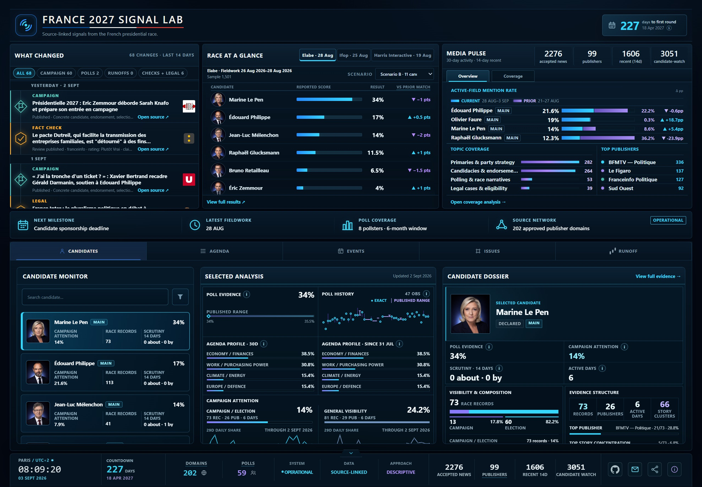
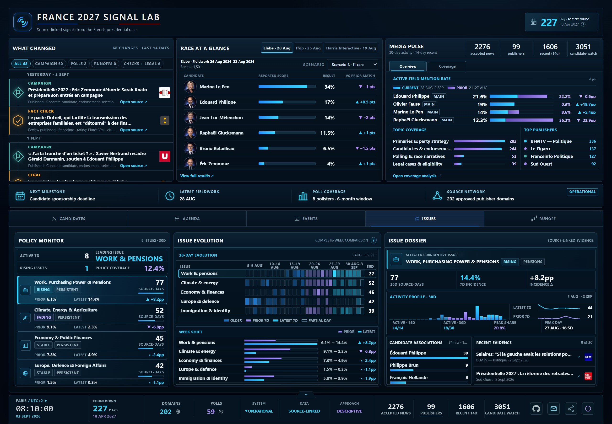
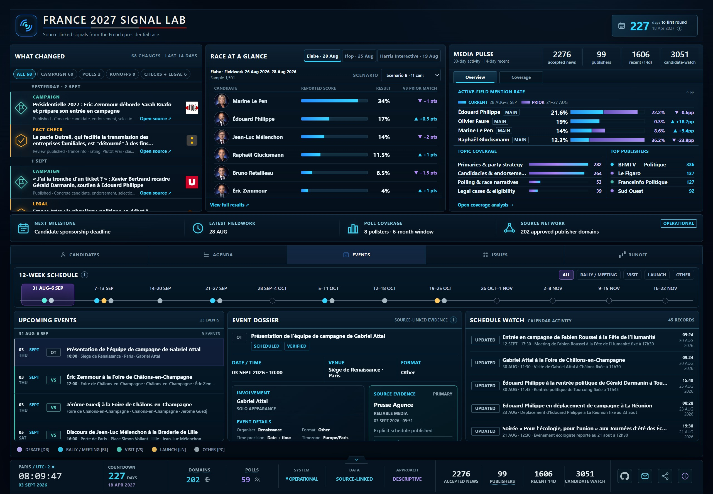

# France 2027 Signal Lab

**Source-linked signals from the French presidential race.**

**France 2027 Signal Lab (FR27)** is an independent public election-monitoring and research dashboard for the 2027 French presidential election.

It brings together published polling, candidate and campaign activity, policy and campaign-agenda signals, media coverage, fact-checking, campaign events, and second-round testing in one inspectable public product.

**Live dashboard:** https://openeventbits.github.io/france-2027-signal-lab/

**Repository:** https://github.com/openeventbits/france-2027-signal-lab

*Production snapshot. Live figures and source coverage change as new evidence is published.*

## What France 2027 Signal Lab does

FR27 is designed to follow a developing presidential race without collapsing different kinds of evidence into a single score or forecast.

Its principal surfaces include:

- **What Changed** — recent campaign, polling, runoff, fact-check, and material legal developments.
- **Race at a Glance** — individual first-round poll events with fieldwork, hypothesis, candidate configuration, source, and comparison context.
- **Media Pulse** — source-linked coverage monitoring, including candidate visibility, topics, publishers, and recent activity.
- **Candidates** — candidate-level polling, campaign attention, agenda evidence, coverage structure, scrutiny, and source-linked dossiers.
- **Agenda and Issues** — evolving campaign-strategy and substantive policy-topic evidence.
- **Campaign Events** — scheduled activity, evidence-backed event dossiers, calendar monitoring, and schedule changes.
- **Runoff** — published second-round tests, common matchups, margins, and comparable matchup history.

Coverage can also be inspected through the **Election Coverage Reader** and **Coverage Analysis**, while **Source Network** exposes information about the configured collection universe.

FR27 is descriptive. It reports and organizes evidence; it does not attempt to predict the election.

## How to read FR27

Several principles govern how evidence is represented.

**Source-linked.** Material signals should remain traceable to their underlying source or provenance.

**No prediction layer.** FR27 does not publish polling averages, election forecasts, win probabilities, voting recommendations, or proprietary candidate scores.

**Comparable evidence only.** Poll scenarios with different candidate configurations are not silently combined into a common trend.

**No invented missing values.** Missing, unavailable, partial, or unresolved evidence is not converted into a false zero or estimate.

**Corpus-aware.** Media and agenda measures describe evidence observed within the accepted FR27 source corpus. They are not presented as measurements of all French media or of public opinion.

When evidence cannot be parsed, reconciled, classified, dated, or attributed with sufficient confidence, FR27 prefers omission or an explicit unresolved state over a misleading result.

## Analytical workspaces

| Policy Issues | Campaign Events |
| --- | --- |
|  |  |
| Topic evolution, weekly shifts, candidate associations, and source-linked evidence. | Verified schedule evidence, event dossiers, upcoming activity, and schedule-watch history. |

## Evidence safeguards

Some FR27 metrics require particular care in interpretation.

First-round polling is stored as complete poll events rather than disconnected candidate scores. Comparable polling history requires compatible scenarios, and incomplete source scenarios remain explicitly incomplete.

Wikipedia Attention measures French Wikipedia **article-reading attention**. It is not a measure of unique individuals, sentiment, approval, electoral support, or voting intention.

Media Pulse describes accepted coverage within the FR27 source universe. Candidate visibility and topic coverage should therefore be read as corpus measurements rather than measures of electoral support.

What Changed is a derived recent-change ledger, not a generic news feed. Its date logic distinguishes the time of a political development from the time the system detected or regenerated it.

The complete measurement definitions and limitations are documented in [`docs/METHODOLOGY.md`](docs/METHODOLOGY.md).

## Engineering and publication

FR27 is primarily a static public data product backed by versioned, inspectable data and code.

Its architecture combines:

- Python ingestion, normalization, classification, and build pipelines;
- explicit data contracts and deterministic identifiers;
- generated JSON publication artifacts;
- source and provenance registries;
- automated validation and regression tests;
- GitHub Actions production workflows;
- publication-manifest checks; and
- a JavaScript/CSS frontend published through GitHub Pages.

Automated production writers are designed to fail closed. Relevant outputs are built and validated before promotion, and last-good published data is preserved when a replacement cannot satisfy its contract.

The repository currently contains separate publication lanes for polling, runoff evidence, candidate status and signals, campaign events, claims, news and coverage data, recent changes, agenda history, candidate attention, and source health.

## Documentation

Documentation is separated by purpose rather than duplicated in the README:

- [`docs/PRODUCT_GUIDE.md`](docs/PRODUCT_GUIDE.md) — how to read the dashboard and its workspaces.
- [`docs/METHODOLOGY.md`](docs/METHODOLOGY.md) — research scope, measurement semantics, classifications, comparability, and limitations.
- [`docs/DATA_AND_PROVENANCE.md`](docs/DATA_AND_PROVENANCE.md) — public datasets, sources, provenance, freshness, and source boundaries.
- [`docs/ARCHITECTURE.md`](docs/ARCHITECTURE.md) — pipelines, contracts, generated artifacts, frontend, workflows, and publication architecture.
- [`docs/OPERATIONS.md`](docs/OPERATIONS.md) — validation, production updates, failure handling, publication integrity, and reproducibility.
- [`CONTRACT.md`](CONTRACT.md) — non-negotiable repository and data invariants.

The repository contract is authoritative for core rules including poll-event integrity, deterministic identity, scenario comparability, missing-data behavior, candidate-universe authority, and fail-closed semantics.

## Source transparency and limitations

FR27 depends on external publishers, pollsters, public bodies, candidate and party sources, Wikimedia services, and other public information sources.

Sources may become unavailable, change format, stop publishing, or fall outside the configured collection universe. Data timestamps, source-health information, warnings, provenance, and unresolved states are exposed where relevant rather than treated as invisible implementation details.

Automated inclusion in the election-news corpus is not equivalent to independent editorial verification of every underlying article or claim. Users should follow source links when evaluating primary evidence.

## Licensing and reuse

The repository is publicly accessible and **source-available**, but its software is not licensed as OSI open-source software.

- Original France 2027 Signal Lab software is licensed under the **PolyForm Noncommercial License 1.0.0**.
- Protected original non-software material is licensed under the **Creative Commons Attribution-NonCommercial 4.0 International Licence (CC BY-NC 4.0)** unless otherwise indicated.
- Third-party material remains subject to the rights, licences, source terms, or legal rules applicable to that material.

Commercial use of protected original France 2027 Signal Lab material requires separate permission.

FR27 does not claim exclusive rights in independently obtainable facts merely because those facts appear in the project.

See [`LICENSE`](LICENSE), [`NOTICE`](NOTICE), [`CONTENT_LICENSE.md`](CONTENT_LICENSE.md), and [`THIRD_PARTY_NOTICES.md`](THIRD_PARTY_NOTICES.md) for the complete licensing framework.

## Contributions

Bug reports, factual corrections, source corrections, reproducibility issues, and documentation corrections are welcome.

FR27 does not currently accept unsolicited substantive external code or other copyrightable contributions. See [`CONTRIBUTING.md`](CONTRIBUTING.md).

## Independence and status

France 2027 Signal Lab is an independently developed public research project. It is not affiliated with, endorsed by, or operated on behalf of any candidate, political party, pollster, publisher, public authority, or other organization represented in its data.

FR27 is actively tracking a developing election. Datasets, candidate status, source coverage, classifications, interfaces, and production methods may evolve as new evidence becomes available.

For permissions or commercial licensing enquiries:

**contact@france2027.app**