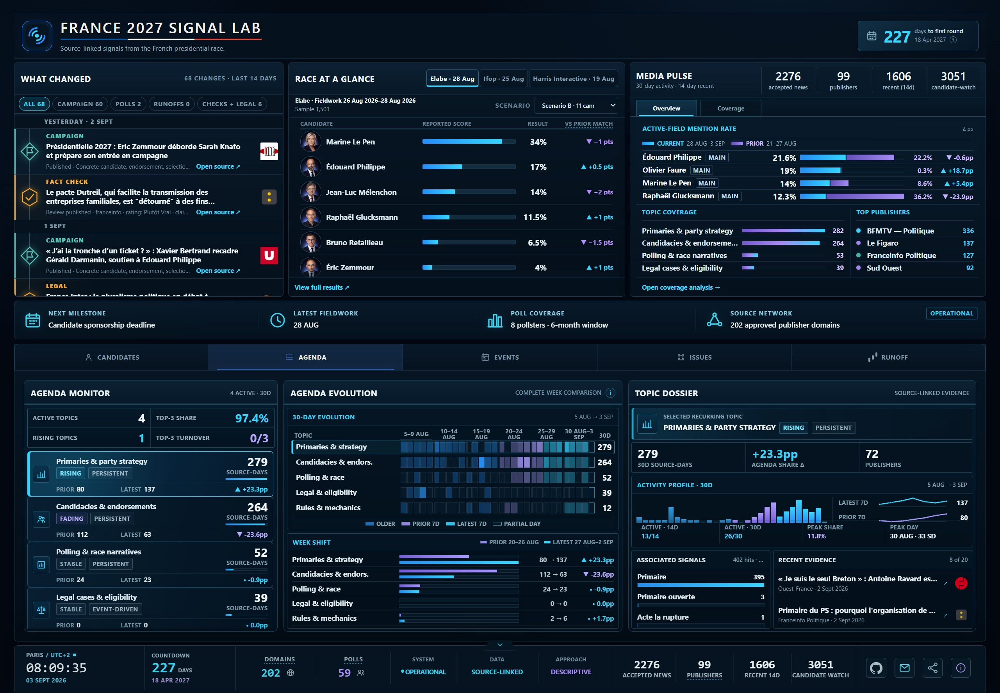
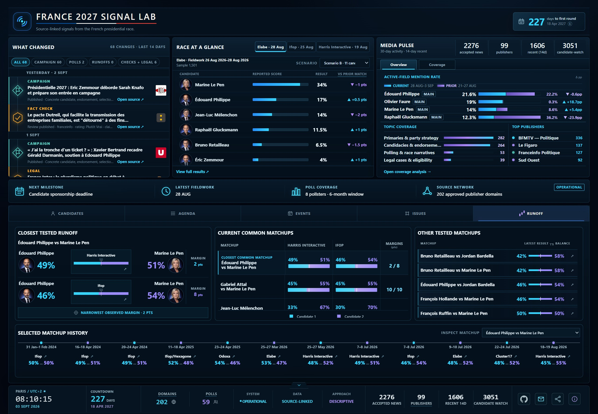
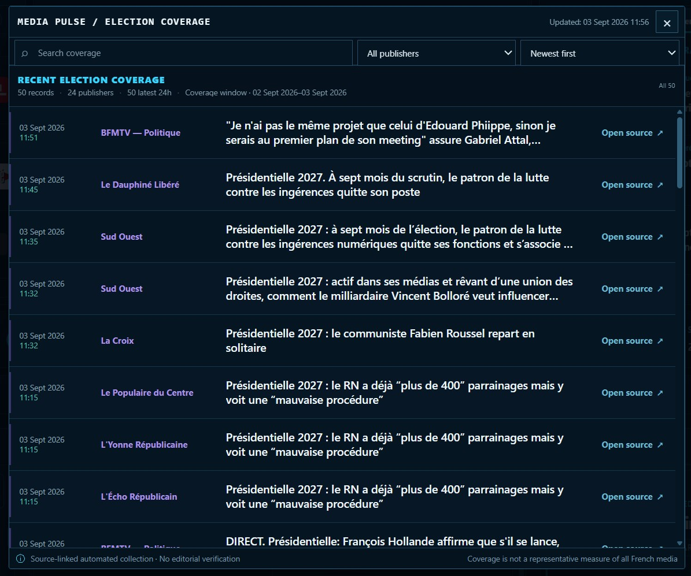
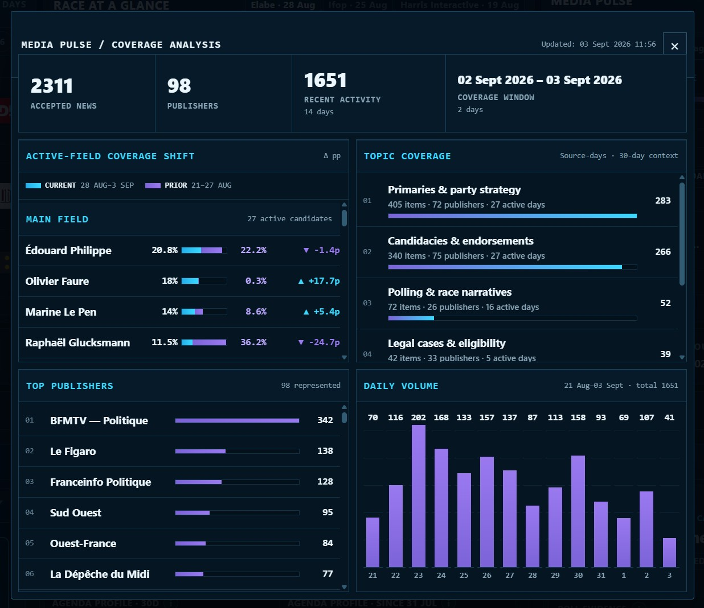

# France 2027 Signal Lab — Product Guide

**France 2027 Signal Lab (FR27)** is a source-linked monitoring and research dashboard for the 2027 French presidential election.

This guide explains how to read the public product: what each major workspace shows, how the different surfaces relate to one another, and what conclusions should — and should not — be drawn from them.

**Live dashboard:** https://openeventbits.github.io/france-2027-signal-lab/

The screenshots in this guide are production snapshots. Live values, candidate status, coverage, events, and source activity change as new evidence is published.

## Product model

FR27 does not reduce the election to a single score.

Instead, it separates different evidence types into distinct but connected views:

- published polling;
- candidate status and candidate-level signals;
- media coverage;
- campaign and policy agenda evidence;
- campaign events;
- fact-checking and scrutiny;
- second-round polling;
- recent political developments; and
- source and collection health.

The purpose of the interface is to let a reader move between **summary signals** and the **evidence beneath them**.

## Common dashboard context

The upper part of the dashboard provides shared context before the specialist workspaces begin.

Key surfaces include:

- **What Changed** — recent material developments detected across FR27 datasets and accepted election coverage;
- **Race at a Glance** — recent first-round polling evidence;
- **Media Pulse** — current coverage activity and candidate visibility;
- **Source Network** — information about the configured collection universe and source activity; and
- **Election Clock** — key timing context for the 2027 election cycle.

These surfaces are designed as orientation tools. More detailed evidence is available in the workspaces and source readers below them.

## Candidates

The **Candidates** workspace brings several evidence types together around one selected candidate.

It is not a candidate ranking.

### Candidate Monitor

The Candidate Monitor provides the working field of monitored political figures and their current status within the FR27 candidate universe.

The monitored field can contain different kinds of political status. Inclusion in the monitor does not mean that all displayed figures have formally declared a candidacy or have identical electoral status.

### Selected Analysis

The analytical view combines several candidate-level evidence modules.

Depending on available evidence, these can include:

- **Poll Evidence** — published first-round testing involving the selected candidate;
- **Campaign Attention** — French Wikipedia article-reading attention;
- **Coverage Mix** — how the selected candidate appears within accepted election coverage;
- **Scrutiny** — accepted fact-check or scrutiny evidence associated with the candidate; and
- agenda or topic evidence derived from the monitored coverage corpus.

These modules measure different things and should not be interpreted as components of a common score.

For example, Wikipedia attention is not electoral support, and media visibility is not polling intention.

### Candidate Dossier

The dossier provides source-linked context for the selected candidate.

Its role is to make the analytical summary inspectable by exposing relevant underlying evidence, status information, source references, and supporting context.

## Campaign Agenda

The **Campaign Agenda** workspace tracks campaign-process and political-strategy themes appearing in accepted election coverage.

Examples can include:

- candidacies and endorsements;
- primaries and party strategy;
- campaign rules and calendar;
- positioning and political integrity;
- legal eligibility; and
- polling and race narratives.

The workspace is descriptive.

It shows which campaign themes are being observed in the FR27 corpus and how their prominence changes over time. It does not attempt to infer the private strategic priorities of candidates or parties.

Topic evidence can be inspected through associated coverage and candidate-level views.

## Policy Issues

The **Policy Issues** workspace tracks substantive policy-topic evidence found in accepted election coverage.

It provides several complementary views.

### Issue Monitor

The monitor shows the current distribution of observed policy topics.

Counts and shares describe the FR27 source corpus rather than French public opinion.

### Issue Evolution

The evolution view shows how observed topic activity changes across time windows.

A rise means that a topic has become more prominent within the measured coverage corpus. It does not mean that voters have become more concerned about that topic.

### Candidate associations

Candidate-topic associations show where accepted evidence links monitored candidates with policy themes.

Association is not equivalent to endorsement, ownership of an issue, or ideological position.

### Issue Dossier

The dossier exposes recent source-linked evidence behind the selected issue so that aggregate topic signals remain inspectable.

## Campaign Events

The **Campaign Events** workspace organizes source-supported campaign scheduling evidence.

It covers qualifying political activity such as campaign meetings, rallies, visits, debates, campaign launches, and other significant scheduled events, together with institutional election milestones where relevant.

### Schedule

The schedule view places known events into a common calendar structure.

Events can differ in evidentiary strength and time precision. FR27 therefore distinguishes between a known date and a fully specified event time rather than inventing missing precision.

### Upcoming

The upcoming view surfaces the next relevant scheduled activity.

### Event Dossier

The dossier records the evidence behind a selected event, including available information such as:

- event type;
- candidate or participants;
- date and time;
- location;
- organization;
- source provenance;
- verification state; and
- status changes.

### Schedule Watch

Schedule Watch records meaningful updates such as newly detected events, confirmations, postponements, cancellations, or other validated changes.

The event system is evidence-driven: ambiguous scheduling information is not automatically promoted into a confirmed event.

## Runoff

The **Runoff** workspace presents published second-round polling evidence.

It is not a forecast of which candidates will reach the second round.

### Tested matchups

Only matchups that have actually been tested in published polling are shown as polling evidence.

A hypothetical pair that has not been tested is not assigned an invented result.

### Latest margins

The workspace can summarize the most recent published margin for tested pairings.

These are poll results, not probabilities.

### Comparable history

Where a matchup has been tested repeatedly under sufficiently comparable conditions, FR27 can show its published history.

Different pairings are not merged into one synthetic runoff trend.

The dashboard explicitly treats second-round polling as **tested hypothetical evidence**, not as a model of the eventual election result.

## Election Coverage Reader

The **Election Coverage Reader** exposes the accepted source items behind FR27's media and agenda signals.

This is an important part of the product's evidence model: aggregate counts can be traced back toward the underlying publisher material.

The reader can expose information such as:

- headline;
- publisher;
- publication time;
- candidate associations;
- topic associations;
- source URL; and
- coverage context.

Where filtering is available, readers can narrow the corpus by candidate or other supported dimensions.

FR27 does not reproduce full third-party articles. The source link remains the place to evaluate the publisher's original work.

## Coverage Analysis

**Coverage Analysis** provides a deeper view of Media Pulse.

Its compact analytical modules include:

### Coverage Shift

Compares candidate visibility across adjacent measured periods when the underlying coverage is sufficiently comparable.

A change represents movement inside the accepted FR27 corpus, not a change in voting intention.

### Topic Coverage

Shows which monitored topics are most present in accepted election coverage.

### Top Publishers

Shows the publishers contributing most strongly to the measured coverage period.

This helps expose corpus composition rather than hiding it behind aggregate metrics.

### Daily Volume

Shows changes in accepted coverage volume across recent days.

Volume should be interpreted together with source-network and publisher context because the quantity of accepted items can be affected by both political activity and source availability.

## Polling evidence

Polling appears in several places across FR27, but the same basic interpretation applies throughout the product.

Each published poll event retains its own:

- pollster;
- fieldwork period;
- round;
- hypothesis;
- candidate configuration;
- reported candidate results; and
- source provenance.

FR27 does not publish a house polling average.

A polling trend is shown only where the relevant events satisfy the project's comparability rules. Different candidate configurations are not silently combined.

Partial or unresolved source evidence remains partial or unresolved rather than being completed with inferred values.

Detailed polling rules are documented in [`METHODOLOGY.md`](METHODOLOGY.md) and [`../CONTRACT.md`](../CONTRACT.md).

## What Changed

**What Changed** is the dashboard's recent-development ledger.

It can contain qualifying changes from categories such as:

- campaign;
- polling;
- runoff;
- fact-checking; and
- material legal or procedural developments.

It is intentionally narrower than the Election Coverage Reader.

The coverage reader answers:

> What relevant material is being published?

What Changed instead answers:

> What appears to have materially changed in the election evidence?

A source publication timestamp, system detection timestamp, and actual political-event date are not treated as interchangeable.

## Signal Desk

The **Signal Desk** brings several live evidence feeds into one compact surface.

Its views can include:

- relevant election news;
- campaign agenda evidence;
- candidate coverage; and
- fact checks.

The Signal Desk is intended for rapid inspection. Deeper interpretation belongs in the dedicated workspaces and source-linked readers.

## Source Network

FR27 uses a configured network of publisher routes, feeds, discovery paths, and other public sources.

The **Source Network** surface exposes summary information about that collection system.

Its purpose is not to claim complete coverage of French political media. Instead, it helps readers understand that media-derived metrics are measurements of a defined and changing corpus.

Source-health and provenance methodology are documented in [`DATA_AND_PROVENANCE.md`](DATA_AND_PROVENANCE.md).

## Reading signals together

The strongest use of FR27 is comparative rather than reductive.

For example, a reader might observe that:

- a candidate has recently been tested in more polling scenarios;
- their Wikipedia attention has risen;
- their share of accepted election coverage has changed;
- particular campaign or policy topics are increasingly associated with them; and
- new campaign events have been scheduled.

Those observations can be viewed together as **separate signals**.

FR27 does not convert them into a hidden composite score, electoral probability, momentum index, or recommendation.

That separation is deliberate.

## Evidence boundaries

Several recurring cautions apply throughout the dashboard:

- **Polling is published polling, not prediction.**
- **Wikipedia attention is reading activity, not voter support.**
- **Media visibility is corpus visibility, not popularity.**
- **Topic counts are observed associations, not candidate ideology.**
- **Campaign events require source-supported scheduling evidence.**
- **Fact-check evidence reflects the monitored review corpus.**
- **Missing evidence is not automatically zero.**
- **Different source classes can have different freshness and coverage.**

More detailed definitions are in [`METHODOLOGY.md`](METHODOLOGY.md).

## Further documentation

- [`METHODOLOGY.md`](METHODOLOGY.md) — what FR27 measures and how evidence should be interpreted.
- [`DATA_AND_PROVENANCE.md`](DATA_AND_PROVENANCE.md) — datasets, source classes, provenance, timestamps, and source health.
- [`ARCHITECTURE.md`](ARCHITECTURE.md) — how the system is built.
- [`OPERATIONS.md`](OPERATIONS.md) — how production updates are validated and published.
- [`../CONTRACT.md`](../CONTRACT.md) — non-negotiable data and repository invariants.
- [`../README.md`](../README.md) — project overview.